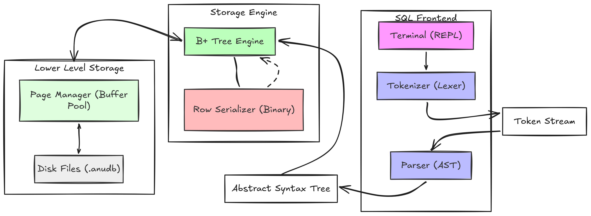
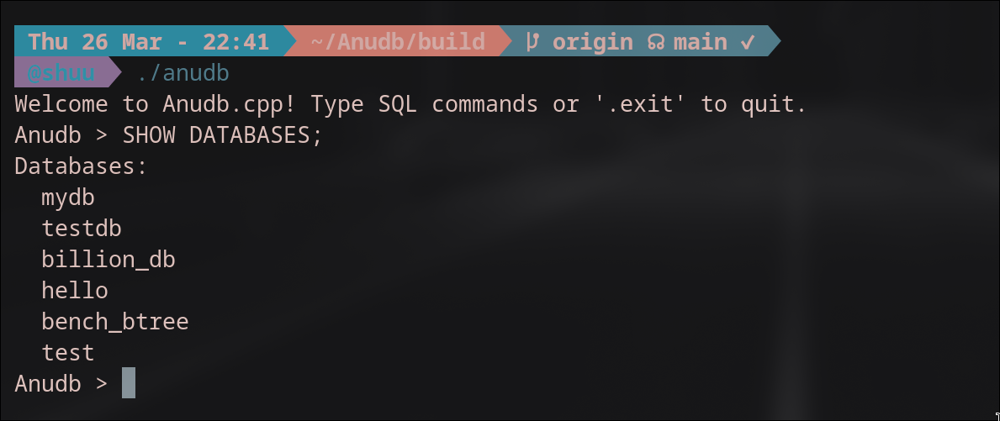
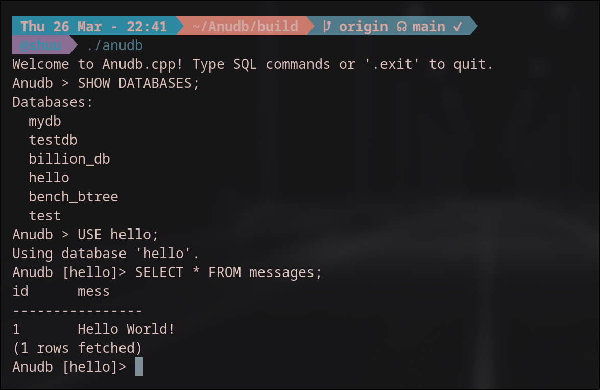

# Anudb.cpp

**An Educational Relational Database Management System (RDBMS) built from scratch in C++17.**

Anudb is an educational deep-dive into how database engines work under the hood—storage engines, query execution, and binary persistence. No high-level abstractions, just raw algorithmic trade-offs.

---

## What Is This?

Anudb is a **single-threaded embedded database** that you can build and run locally. It implements:

- **Custom B+Tree Storage Engine** — Hand-rolled clustered indexing with node splitting
- **Recursive Descent SQL Parser** — Lexer and Parser for SQL grammar (no external generators)
- **Memory-Mapped I/O** — OS page cache via `mmap()` in `PageManager`
- **Binary Serialization** — Length-prefixed strings and bitpacked primitives
- **Full CRUD** — `CREATE`, `INSERT`, `SELECT`, `UPDATE`, `DELETE` with `WHERE` clauses

---

## System Architecture



### Components

| Component       | Purpose                                                |
| -----------------| --------------------------------------------------------|
| `main.cpp`      | Stateless REPL loop — reconstructs context per command |
| `Tokenizer`     | Lexical analysis → vector of Tokens                    |
| `Parser`        | Grammar resolution → polymorphic AST Statement         |
| `Executor`      | Routes AST to storage engine                           |
| `BPlusTree`     | Indexing, leaf/internal nodes, range scans             |
| `PageManager`   | Memory-mapped file I/O                               |
| `RowSerializer` | Binary row encoding/decoding                           |

---

## Building

**Requirements:** C++17 compiler (GCC 9+ or Clang 10+), CMake 3.15+

```bash
mkdir build && cd build
cmake ..
make
```

### Running Tests

```bash
# Storage engine tests
./test_bplustree

# Binary serialization tests
./test_serializer

# Benchmark (1M+ ops/sec)
./test_bplustree --benchmark
```

### Running the Database

```bash
./anudb
```

### Demo




### Interactive Examples

```bash
# Run a SQL script
./anudb < script.sql

# Create a database
CREATE DATABASE mydb;
USE mydb;
CREATE TABLE users (id INT, name TEXT, age INT);
INSERT INTO users VALUES (1, 'Alice', 30);
SELECT * FROM users;
.exit
```

---

## How Storage Works

### File Structure

| Extension | Content |
|---|---|
| `.anudb` | Schema definitions, auto-increment IDs, root pointers |
| `.anudb_data` | Binary B+Tree pages |

### Page Size

- Fixed at **4096 bytes** (SSD block alignment)
- Node capacity calculated from this constraint

### B+Tree vs HashMap

B+Tree was chosen over HashMap specifically for **sequential range scans**. Leaf nodes are linked in a continuous list:

```
Leaf1 ──next──▶ Leaf2 ──next──▶ Leaf3 ──next──▶ ...
```

This enables $O(N)$ sequential reads vs $O(\log N)$ traversal per query.

### Node Types

| Type | Keys | Values |
|---|---|---|
| **Internal** | `int64_t` | `uint32_t` child page pointers |
| **Leaf** | `int64_t` | Variable-length `uint8_t*` row data |

---

## Supported SQL Commands

```sql
-- Create a database
CREATE DATABASE mydb;

-- Use a database
USE mydb;

-- Create a table
CREATE TABLE users (id INT, name TEXT, age INT);

-- Insert data
INSERT INTO users VALUES (1, 'Alice', 30);
INSERT INTO users VALUES (2, 'Bob', 25);

-- Query data
SELECT * FROM users;
SELECT name, age FROM users WHERE id = 1;

-- Update data
UPDATE users SET age = 31 WHERE id = 1;

-- Delete data
DELETE FROM users WHERE id = 2;
```

---

## Detailed Docs

For deep dives:

- [System Architecture](docs/01-System-Architecture.md) — Components, B+Tree, data flow
- [Storage & Memory](docs/02-Storage-Memory.md) — PageManager, file I/O, serialization
- [Query Processing](docs/03-Query-Processing.md) — Tokenizer, parser, executor
- [REPL & Testing](docs/04-REPL-Context.md) — Interactive interface, benchmarks

---


